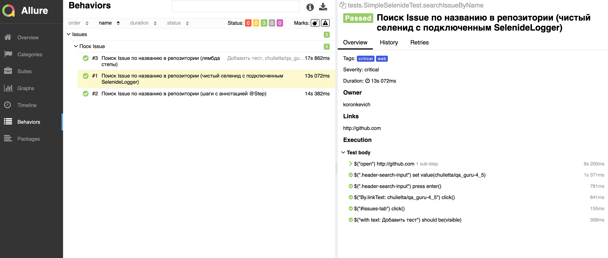
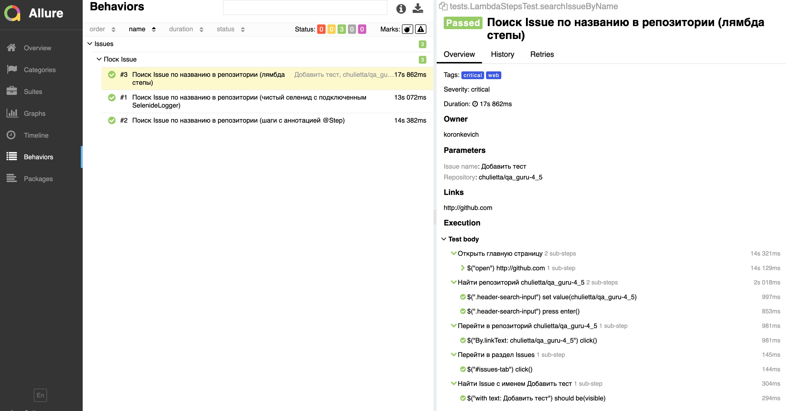
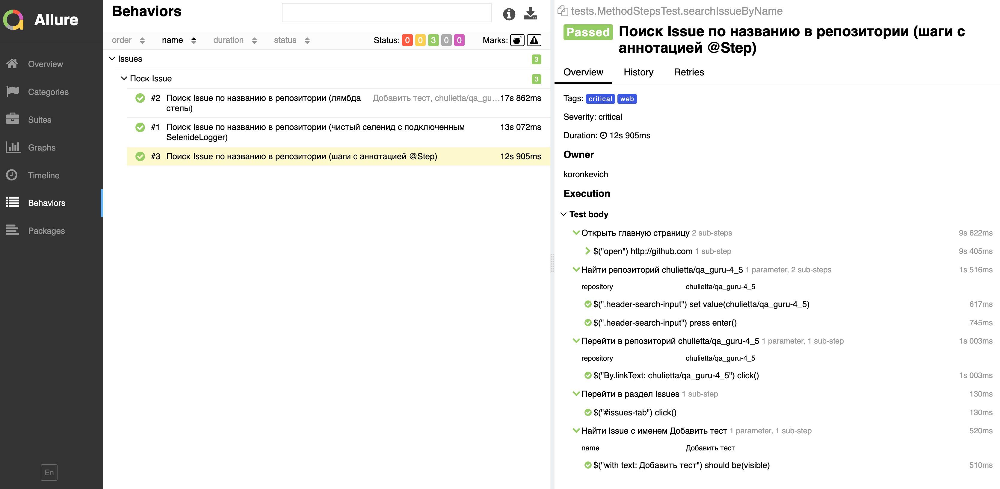

# qa_guru_4_5

Подключение Allure Reports и настройка отчетности о прохождении автотестов.

1. SimpleSelenideTest - Чистый Selenide тест с подключенным SelenideLogger

2. LambdaStepsTest - Лямбда шаги через step (name, () -> {})

3. MethodStepsTest - Шаги с аннотацией @Step

